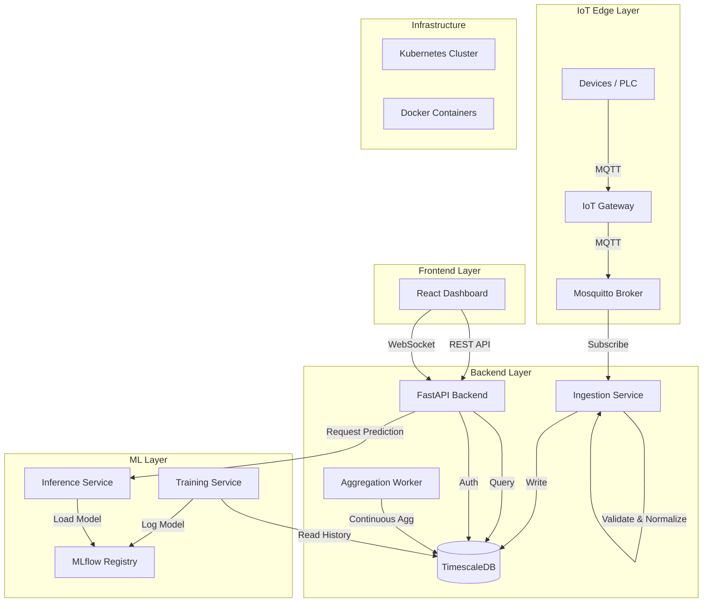

# ZeroCraftr System Architecture

## Component Description

1.  **IoT Gateway**: Edge devices or software pushing telemetry to the broker.
2.  **Mosquitto Broker**: Central message bus for MQTT.
3.  **Ingestion Service**: Python/FastAPI service consuming MQTT topics, validating schemas, and writing to TimescaleDB.
4.  **TimescaleDB**: PostgreSQL extension for time-series data, handling raw telemetry and continuous aggregates.
5.  **FastAPI Backend**: REST API for frontend, handling Auth, CRUD, and data retrieval.
6.  **ML System**:
    *   **Training**: Batch jobs to retrain models.
    *   **Inference**: Real-time optimization recommendations.
7.  **React Dashboard**: User interface for monitoring and management.
